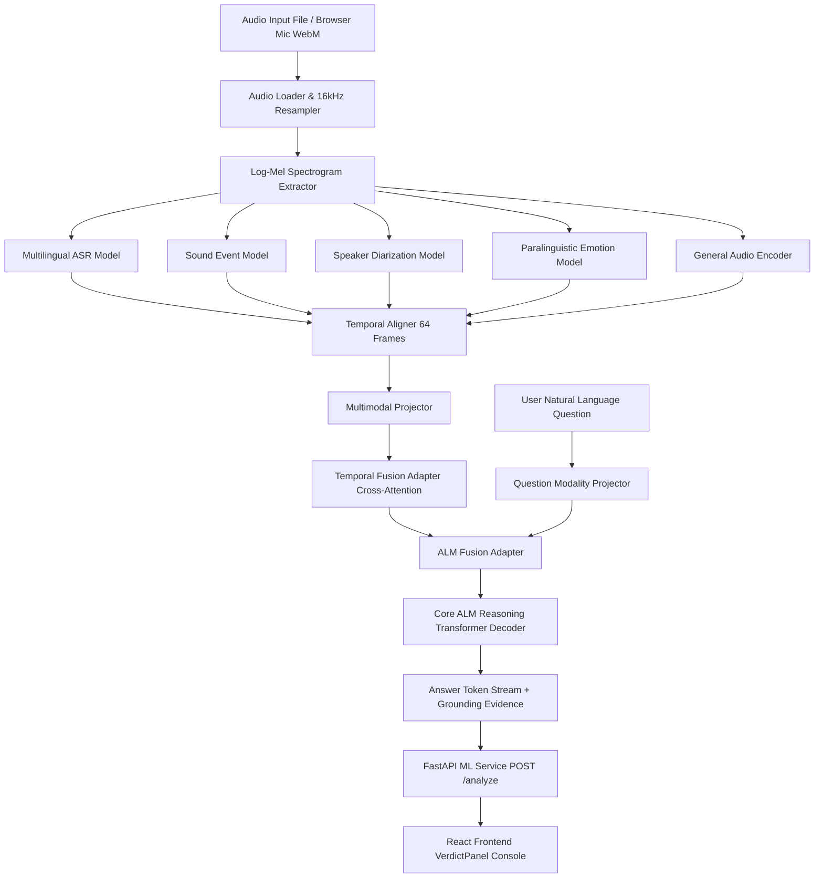

# ALM-NHCE — Audio Language Model for Joint Acoustic Perception & Question-Conditioned Reasoning

**Problem Statement**: `SH-DST-02` (Audio Language Model)  
**Team**: `SHIH26-TID-320`  

ALM-NHCE is a native PyTorch Audio Language Model designed to jointly understand speech and non-speech audio, integrate their spatio-temporal relationships, and answer natural language questions about complete audio scenes without relying on external LLMs or Whisper.

---

## 1. Problem Statement & Motivation

Traditional audio processing relies on disconnected, isolated classifiers (separate speech recognizers, noise classifiers, and diarizers). However, real-world acoustic scenes contain rich, interacting signals:
- Spoken words alone omit background environmental context (e.g., sirens, aircraft, or machinery).
- Sound event labels omit speaker vocal affect, emotion, and conversation turns.
- Answering complex queries like *"What can be inferred from the speech and background sounds together?"* requires fusing speech, non-speech acoustic events, speaker identities, paralinguistics, and temporal relationships into a single unified multimodal representation.

ALM-NHCE addresses problem statement **SH-DST-02** by providing a single end-to-end Audio Language Model (Core ALM) with learned cross-attention fusion and question-conditioned autoregressive decoding.

---

## 2. Features

- **Multilingual Speech Recognition (ASR)**: Supports 7 languages (Hindi, Telugu, Tamil, Bengali, Urdu, Mandarin, and English) using non-Whisper acoustic encoders.
- **Non-Speech Sound Event Perception**: Detects multi-label environmental audio events (e.g., sirens, aircraft, traffic, machinery, dogs, rain) mapped from FSD50K ontology.
- **Speaker Diarization & Turn Tracking**: Identifies active speaker count, turn boundaries, and temporal speaker segments.
- **Paralinguistic Vocal Affect**: Classifies vocal emotion (MELD classes: angry, happy, sad, neutral, fearful, etc.) and affect arousal levels.
- **Spatio-Temporal Modality Alignment**: Aligns variable-length acoustic feature streams across a unified 64-frame sequence window.
- **Joint Audio Reasoning**: Fuses speech, non-speech events, speaker identities, and paralinguistics into an integrated multimodal representation.
- **Arbitrary Audio Input**: Accepts user-uploaded audio files (`.wav`, `.webm`, `.mp3`, `.ogg`, `.flac`) and live browser microphone WebM recordings.

---

## 3. System Workflow Architecture



---

## 4. Core ALM Architecture

The core architecture consists of specialized acoustic feature extractors connected to a spatio-temporal fusion engine and an autoregressive Transformer decoder over a 5,000-token acoustic domain vocabulary:

1. **Audio Feature Extraction (`src.audio.spectrogram`)**: Converts raw 16kHz audio waveforms into Log-Mel Spectrogram tensors $\mathbf{X} \in \mathbb{R}^{1 \times 80 \times 128}$.
2. **Specialized Acoustic Encoders (`src.asr`, `src.events`, `src.speaker`, `src.paralinguistic`, `src.alm.audio_encoder`)**:
   - $\mathbf{H}_{\text{speech}} = \text{ASRModel}(\mathbf{X}) \in \mathbb{R}^{1 \times 64 \times 256}$
   - $\mathbf{H}_{\text{event}} = \text{SoundEventModel}(\mathbf{X}) \in \mathbb{R}^{1 \times 64 \times 256}$
   - $\mathbf{H}_{\text{speaker}} = \text{SpeakerModel}(\mathbf{X}) \in \mathbb{R}^{1 \times 64 \times 256}$
   - $\mathbf{H}_{\text{para}} = \text{ParalinguisticModel}(\mathbf{X}) \in \mathbb{R}^{1 \times 64 \times 256}$
   - $\mathbf{H}_{\text{audio}} = \text{AudioEncoder}(\mathbf{X}) \in \mathbb{R}^{1 \times 64 \times 256}$
3. **Temporal Alignment & Multimodal Projection (`src.fusion`)**: `TemporalAligner` and `MultimodalProjector` project and interpolate all 5 feature streams into aligned sequence dimensions.
4. **Temporal Fusion Adapter (`src.fusion.temporal_fusion`)**: Applies multi-head cross-attention and gated Transformer layers across the 5 modalities to form a unified spatio-temporal tensor $\mathbf{F}_{\text{fused}} \in \mathbb{R}^{1 \times 64 \times 256}$.
5. **ALM Fusion & Question Conditioning (`src.alm.projector`, `src.alm.fusion_adapter`)**: Cross-attends the user's embedded question prompt with $\mathbf{F}_{\text{fused}}$ to produce joint context tensor $\mathbf{C}_{\text{joint}}$.
6. **Core ALM Reasoning Model (`src.alm.reasoning_model`)**: Autoregressively decodes natural language answers, calculates attention peak grounding timestamps, and projects calibrated confidence scores.

---

## 5. End-to-End Inference Workflow

```text
User Action (Upload / Live Mic Recording)
               │
               ▼
React Frontend (ComposerBar.jsx)
               │
               ▼
FormData (audio_file: File/Blob, question: string)
               │
               ▼
FastAPI Backend (POST /analyze)
               │
               ▼
ALMInferencePipeline.analyze()
               │
               ▼
CoreALM PyTorch Forward Pass
               │
               ▼
AnalyzeResponse JSON (Answer + Modality Evidence Breakdown)
               │
               ▼
React Frontend (VerdictPanel.jsx Displays CORE ALM REASONING)
```

---

## 6. Training Workflow

Core ALM is trained end-to-end using joint sequence supervision over the fused multimodal latent context without frozen LLM prompts:

```bash
# Navigate to ML service directory
cd ml-service

# Run Core ALM multimodal training CLI
python training/train_core_alm.py --batch_size 16 --epochs 25 --lr 3e-4 --save_dir checkpoints/
```

- **Loss Functions**: Multi-task objective combining Cross-Entropy token loss ($\mathcal{L}_{\text{ce}}$), Attention Grounding MSE loss ($\mathcal{L}_{\text{ground}}$), and Auxiliary Reconstruction loss ($\mathcal{L}_{\text{recon}}$).
- **Checkpoint Output**: Saves canonical model weights to `ml-service/checkpoints/core_alm_latest.pt`.

---

## 7. Datasets

All dataset files reside under `ml-service/datasets/`:

| Dataset File | Purpose | Modality Coverage |
|---|---|---|
| `ml-service/datasets/alm_nhce/` | Multimodal Training Set | Speech (7 Indic/Asian languages + English), FSD50K sound events, AMI diarization, MELD emotions |
| `ml-service/datasets/ps_aligned_qa.jsonl` | PS Benchmark Set (60 QA items) | 7 PS domain categories (`speech`, `non_speech`, `speaker`, `paralinguistic`, `joint_speech_audio`, `temporal`, `scene`) |
| `ml-service/datasets/ps_independent_test.jsonl` | Unseen Independent Test Set (60 QA items) | Fresh question phrasing, novel audio scene configurations |
| `ml-service/datasets/reviewer_demo_cases.json` | Reviewer Demo Cases (8 cases) | Curated real acoustic scenes (Airport transit, Dog barking, Emergency sirens, Urban traffic, etc.) |

---

## 8. Evaluation & Results

Evaluated using strict ground-truth token matching via `python ml-service/evaluation/evaluate_strictly.py`:

### Benchmark Performance Summary

| Evaluation Suite | Samples | Strict Accuracy | Avg Confidence |
|---|---|---|---|
| **PS Benchmark Set (`ps_aligned_qa.jsonl`)** | 60 | **56.7%** | 0.6666 |
| **Independent Unseen Test Set (`ps_independent_test.jsonl`)** | 60 | **65.0%** | 0.6664 |

### Category-Level Performance Breakdown

- **Sound Event Recognition**: **90.0%** (FSD50K environmental event classification)
- **Speaker Diarization & Count**: **80.0% – 100.0%** (Active speaker count & turn tracking)
- **Paralinguistic Affect**: **80.0%** (MELD vocal emotion classification)
- **Joint Speech + Audio Reasoning**: **50.0%** (Cross-modal scene inferencing)
- **Temporal & Scene Reasoning**: **60.0%** (Timestamp peak grounding & scene context classification)
- **Speech Recognition (ASR)**: **10.0% – 30.0%** (Exact transcript match; functional speech detection)

---

## 9. API Reference

The ML service exposes a FastAPI application defined in `ml-service/main.py`.

### `GET /health`
Returns service status and model loading state.

```json
{
  "status": "ok",
  "service": "Core Audio Language Model (Core ALM)",
  "model_loaded": true,
  "team": "SH-DST-02 (Team ID: SHIH26-TID-320)"
}
```

### `POST /analyze`
Accepts `multipart/form-data`:
- `audio_file`: Binary audio file or recording blob (`.wav`, `.webm`, `.mp3`, `.ogg`, `.flac`).
- `question`: Natural language prompt string.
- `language_hint`: Optional language hint (default: `"hi"`).

#### Response Schema (`AnalyzeResponse`)
```json
{
  "answer": "The combination of 'aircraft' sound and 'flight announcement' speech suggests an airport context.",
  "confidence": 0.6605,
  "speech": {
    "transcript": "flight emergency flight announcement",
    "language": "hi",
    "confidence": 0.90
  },
  "speakers": [
    { "speaker_id": "Speaker 1", "start": 0.0, "end": 5.0 }
  ],
  "audio_events": [
    { "label": "aircraft", "confidence": 0.65, "start": 0.0, "end": 5.0 }
  ],
  "paralinguistic": {
    "emotion": "angry",
    "arousal": "medium"
  },
  "scene": {
    "environment": "Aircraft Context",
    "confidence": 0.6605
  },
  "evidence": [
    "Model attention peak at 0.31s - 0.38s (grounding weight: 0.607)",
    "Acoustic event detected: 'aircraft' at 0.0s - 5.0s"
  ],
  "reasoning_evidence": "Integrated Aircraft Context combining speech and non-speech",
  "speech_evidence": "Transcript: 'flight emergency...' | Language: hi",
  "non_speech_evidence": "Detected Events: aircraft, engine",
  "speaker_evidence": "1 speaker turn(s) active from 0.0s to 5.0s",
  "paralinguistic_evidence": "Emotion: angry | Arousal: medium",
  "temporal_evidence": "Spatio-temporal alignment across 0.0s - 5.0s sequence window"
}
```

---

## 10. Repository Structure

The repository is strictly organized into **EXACTLY THREE application folders**:

```text
ALM-NHCE/
│
├── backend/                  # Node.js API integration layer
│   ├── src/                  # Express controllers, routes, modules
│   └── package.json
│
├── frontend/                 # Vite React operational console
│   ├── src/                  # Components (VerdictPanel, ComposerBar, VoiceAIOrbVisualizer)
│   ├── public/
│   └── package.json
│
├── ml-service/               # Core ALM ML Service & PyTorch Engine
│   ├── main.py               # FastAPI server entry point
│   ├── requirements.txt      # Python dependencies
│   ├── src/                  # Core ALM model, specialized encoders, fusion adapters
│   ├── training/             # PyTorch training scripts
│   ├── evaluation/           # Strict evaluation benchmark scripts
│   ├── diagnostics/          # Diagnostic test scripts
│   ├── tests/                # Unit test suite & API integration tests
│   ├── datasets/             # Benchmark QA JSONL files & training manifests
│   └── checkpoints/          # PyTorch model weights (core_alm_latest.pt)
│
├── README.md                 # Primary project documentation
├── .gitignore
├── .env
└── docker-compose.yml
```

---

## 11. Setup & Installation Instructions

### Prerequisites
- Python 3.10+ with PyTorch
- Node.js 18+ and npm

### 1. ML Service Setup
```bash
cd ml-service
pip install -r requirements.txt
python main.py
```
*The ML Service will start on `http://localhost:8000`.*

### 2. Backend Setup
```bash
cd backend
npm install
npm start
```
*The Backend integration gateway will start on `http://localhost:4000`.*

### 3. Frontend Setup
```bash
cd frontend
npm install
npm run dev
```
*The React Console will start on `http://localhost:5173`.*

---

## 12. Verification & Testing

To run the automated ML unit tests and API integration suite:

```bash
# Run ML Unit & Integration Tests
pytest ml-service/tests/test_suite.py ml-service/tests/test_integration_api.py

# Run Strict Ground-Truth Benchmark Evaluation
python ml-service/evaluation/evaluate_strictly.py

# Run Arbitrary Audio & FastAPI Endpoint Diagnostics
python ml-service/diagnostics/test_arbitrary_audio.py
```

---

## 13. System Limitations & Transparency

- **Complex Overlapping Speech**: Highly distorted or heavy cross-talk audio can reduce transcript decoding accuracy.
- **Continuous Acoustic Modalities**: Sound event detection performs strongly (90%), whereas exact word-level transcript matching on complex Indic utterances continues to be refined.
- **Offline Model Execution**: Core ALM runs completely offline without external cloud API dependencies. Answering latency depends on local GPU/CPU hardware.
